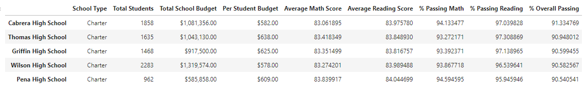

# Written Report of the School District Analysis

## ***Overview of the school district analysis***

### **Purpose**
<!--Explain the purpose of this analysis.-->
<!--The purpose of this analysis is well defined (3 pt).-->

Present a report that summarize an updated school district analysis after replacing the reading and math scores for the ninth grade at Thomas High School. This report will be provided to the City School District with a comparisson of previous results vs. the new results found, with the goal to help the school board with the insight of results to complement their the full extent analysis, in order to be able to make the strategic decisions for the budgets allotments.

 

## ***Results***
<!--Using bulleted lists and images of DataFrames as support, address the following questions.-->
<!--There is a bulleted list that addresses how each of the seven school district metrics was affected by the changes in the data (10 pt).-->

- ### **How is the district summary affected?**

    <table>
        <tr>
            <td>Original District Summary</td>
        </tr>
        <tr>
            <td></td>
        </tr>
        <tr>
            <td>New District Summary</td>
        </tr>
        <tr>
            <td></td>
        </tr>
    </table>

        In here we can observe that the differences are very subtle and we can think there are no changes because of the first 4 columns, but you can start noticing at the Averages and Percentages; where the most perceptive change is in the Overall Passing with a difference of 0.3%.

- ### **How is the school summary affected?**

    <table>
        <tr>
            <td>Original School Summary</td>
        </tr>
        <tr>
            <td></td>
        </tr>
        <tr>
            <td>New School Summary</td>
        </tr>
        <tr>
            <td></td>
        </tr>
    </table>

        As well we can observe that the difference is very subtle and in this case even more, because there's more shown data and most of it didn't changed. We have to observe directly to the row where is mentioned the Thomas High School to see really the changes at the Averages, Percentages, and Overall Passing; the changes are mostly in the decimal numbers.

- ### **How does replacing the ninth graders’ math and reading scores affect Thomas High School’s performance relative to the other schools?**

    <table>
        <tr>
            <td>Original Top 5 Schools Performance</td>
        </tr>
        <tr>
            <td></td>
        </tr>
        <tr>
            <td>New Top 5 Schools Performance</td>
        </tr>
        <tr>
            <td></td>
        </tr>
    </table>

        In terms of an overall performance, Thomas High School was not affected, it still stands in the 2nd place of the school area. In a more detailed x-ray, as previous comments, the affectation of their performance is in Averages, Percentages, and Overall.

- ### **How does replacing the ninth-grade scores affect the following:**

  - #### Math and reading scores by grade

    <table>
        <tr>
            <td>Original Math Scores</td>
            <td>&nbsp;&nbsp;</td>
            <td>New Math Scores</td>
        </tr>
        <tr>
            <td></td>
            <td>&nbsp;&nbsp;&nbsp;&nbsp;&nbsp;&nbsp;&nbsp;&nbsp;&nbsp;&nbsp;&nbsp;&nbsp;&nbsp;&nbsp;&nbsp;&nbsp;&nbsp;&nbsp;&nbsp;&nbsp;&nbsp;&nbsp;&nbsp;</td>
            <td></td>
        </tr>
        <tr>
            <td>Original Reading Scores</td>
            <td>&nbsp;&nbsp;</td>
            <td>New Reading Scores</td>
        </tr>
        <tr>
            <td></td>
            <td>&nbsp;&nbsp;&nbsp;&nbsp;&nbsp;&nbsp;&nbsp;&nbsp;&nbsp;&nbsp;&nbsp;&nbsp;&nbsp;&nbsp;&nbsp;&nbsp;&nbsp;&nbsp;&nbsp;&nbsp;&nbsp;&nbsp;&nbsp;</td>
            <td></td>
        </tr>
    </table>

        The replacing affects only the scores of both subjects in the 9th grade of the Thomas High School. It is clearly stated as a "NaN".

  - #### Scores by school spending

    <table>
        <tr>
            <td>Original School Spending</td>
        </tr>
        <tr>
            <td></td>
        </tr>
        <tr>
            <td>New School Spending</td>
        </tr>
        <tr>
            <td></td>
        </tr>
    </table>

        In the shown images we can see that there's no change at all, but mostly because of the 'format' applied in the code. Indeed there're a diferences in the whole row of "$630 - $644" Spending Range, but as being only at the decimals, when we round the numbers, it seems like there's no change because it didn't affect much.
        
  - #### Scores by school size

    <table>
        <tr>
            <td>Original School Size</td>
        </tr>
        <tr>
            <td></td>
        </tr>
        <tr>
            <td>New School Size</td>
        </tr>
        <tr>
            <td></td>
        </tr>
    </table>

        As well, because of the 'format', in the shown images we can see that there's no change at all. So going to a previous step of our code/results, we can see that there're some minimal decimal diferences in the whole row of "Medium (1001 - 1999)" School Size.

  - #### Scores by school type

    <table>
        <tr>
            <td>Original School Type</td>
        </tr>
        <tr>
            <td></td>
        </tr>
        <tr>
            <td>New School Type</td>
        </tr>
        <tr>
            <td></td>
        </tr>
    </table>

        Taking in mind the same tendency as the two previous comparissons, in the shown images we can see that there's no change at all because of the formattion. But checking on step before of our code/results, there're small variations at the whole row of the Charter Type.

 

## ***Summary***
<!--Summarize four changes in the updated school district analysis after reading and math scores for the ninth grade at Thomas High School have been replaced with NaNs.-->
<!--There is a statement summarizing four changes to the school district analysis after reading and math scores have been replaced (5 pt).-->

As a general comment of the analysis, we can see by the shown images, comparissons, and previous insights that the small amount of students of the ninth grade of the Thomas High School (THS) did not affect on a more larger scale. We are talking that from the whole population (School District Area - 15 High Schools), the THS - 9th grade was only a 1.18% of the 39,170 total students.

Even though, the previous delivered analysis needed an update with the replaced information of the THS - 9th grade, in order to have the correct information. So, we had to take in mind that as being only a small percentage that was replaced, the changes were minimal, and almost imperceptible. Here are some changes:

- Decrease at the District Summary at both Averages and both Percentages, but mos notorious at the Overall Passing.
- Decrease at the School Summary at the Averages, Percentages, and Overall Passing, but only for the Thomas High School row.
- For the Performance, it didn't affect the postion of the THS. It maintained in the second position, only affected their Averages, Percentages, and Overall Passing.
- Finally, as the 9th grade being replaced by a "NaN" value, it moved the needle of the "$630 - $644" Spending Range row, "Medium (1001 - 1999)" School Size, and the Charter Type.